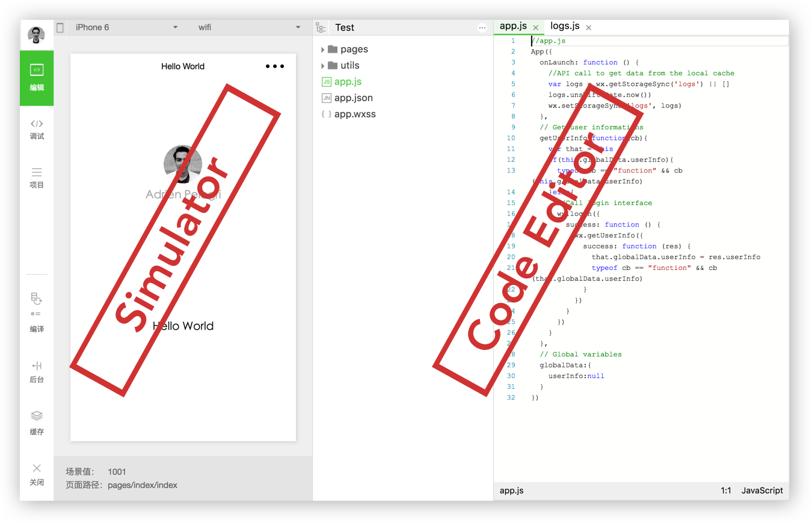
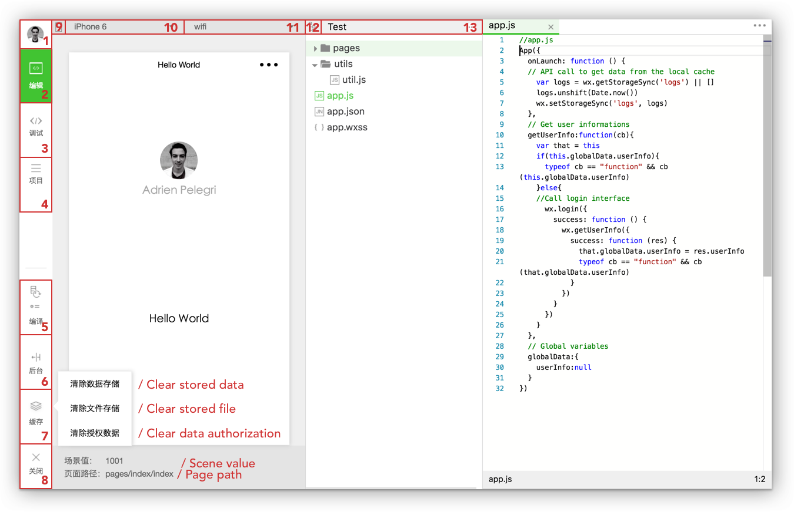
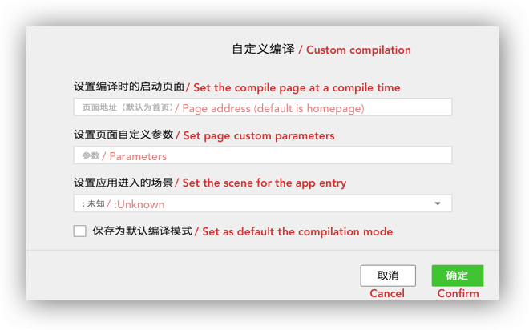
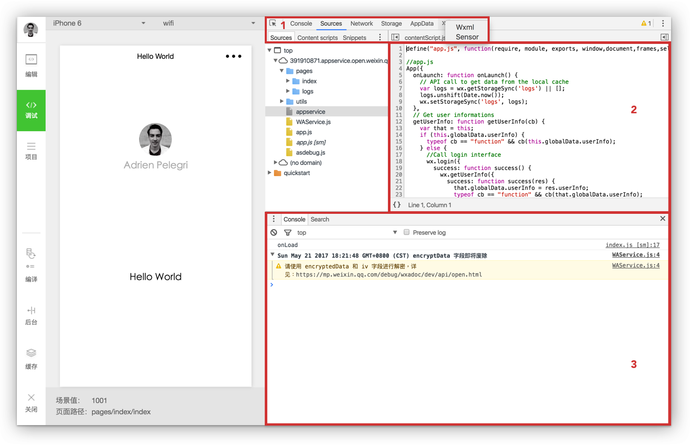
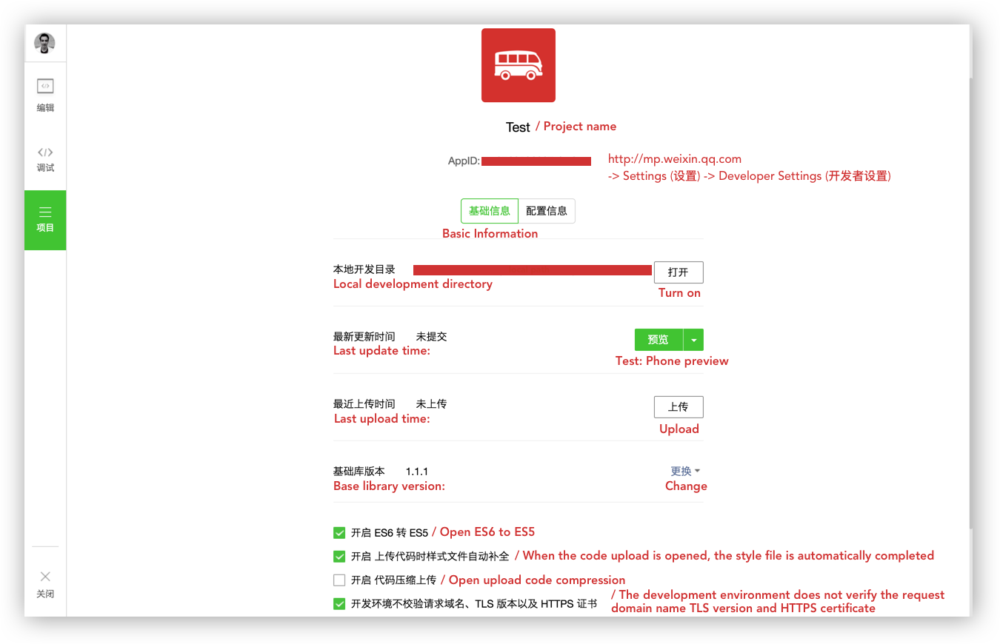
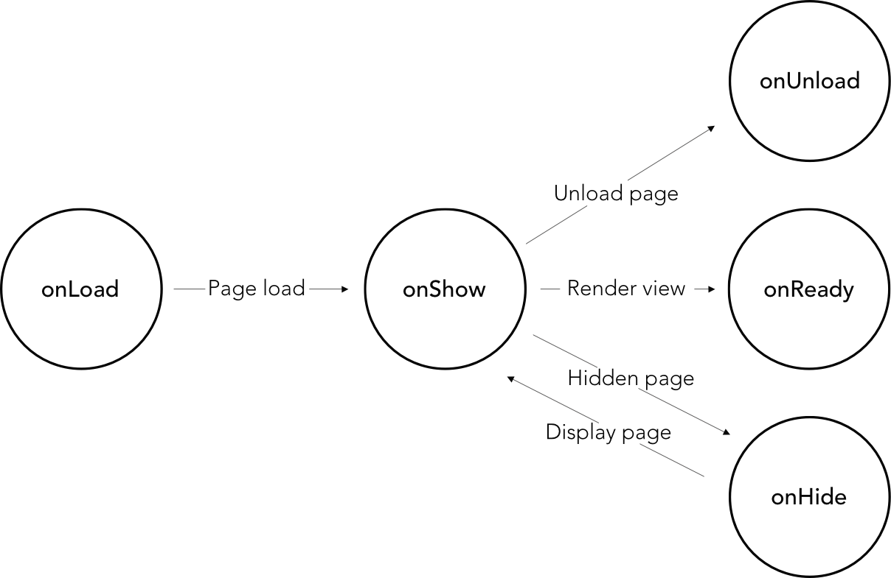
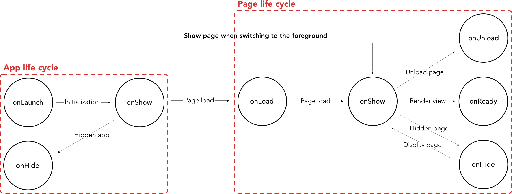
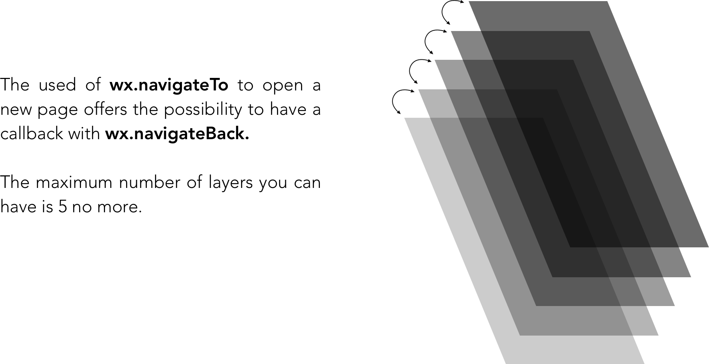
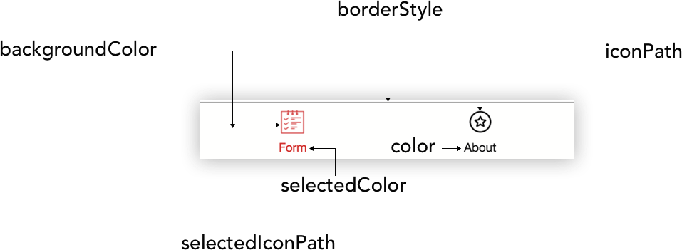
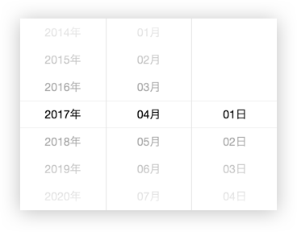

# WeChat mini-program documentation

## Summary

- [Registration process](#registration-process)
- [WeChat IDE](#wechat-ide)
- [Dig into the "quickstart" project](#dig-into-the-quickstart-project)
  - [Root directory](#root-directory)
  - [Quickstart project pages](#quickstart-project-pages)
  - [Take-away from the "quickstart" project](#take-away-from-the-quickstart-project)
- [The life cycle of your MP](#the-life-cycle-of-your-mp)
    - [Application life cycle](#application-life-cycle)
    - [Page life cycle](#page-life-cycle)
    - [App life cycle affects page life cycle](#app-life-cycle-affects-page-life-cycle)
- [Core setup of your MP](#core-setup-of-your-mp)
    - [Routing](#routing)
    - [TabBar](#tabbar)
    - [Window](#window)
    - [Network timeout](#network-timeout)
- [Create dynamic pages](#create-dynamic-pages)
    - [WXML - HTML, what's the deal?](#wxml---html-whats-the-deal)
    - [Data binding](#data-binding)
    - [List rendering: wx:for](#list-rendering-wxfor)
    - [Conditional rendering: wx:if, wx:elif, wx:else](#conditional-rendering-wxif-wxelif-wxelse)
    - [Template](#template)
    - [Events](#events)
    - [Mini-program sharing](#mini-program-sharing)
- [WeChat design guidelines](#wechat-design-guidelines)
    - [WXSS](#wxss)
    - [Style import](#style-import)
- [Built-in components](#builtin-components)
    - [Navigator](#navigator)
    - [Scroll view](#scroll-view)
    - [Picker](#picker)
    - [Switch](#switch)
    - [Toast](#toast)
- [Leancloud DB](#leancloud-db)
    - [Install and initialize](#install-and-initialize)
    - [Persist data](#persist-data)
    - [Leancloud dashboard](#leancloud-dashboard)
    - [Module](#module)
- [WeChat API](#wechat-api)
    - [Get user information](#get-user-information)
    - [Data cache](#data-cache)
    - [Open the QR code scanner](#open-the-qr-code-scanner)
    - [Location-base services](#locationbase-services)
    - [Image upload](#image-upload)

## Registration process
The registration process is really tough and even more if you don’t have any experience with the pleasure of Chinese administrative world. 
WeChat verification process will be recurrent all along your path to register, keep calm.

From the registration of a Wechat mini-program to the development release you need to go through these two steps: 

* **Pick the right type of application** and go through the registration process. 
* Completion of mini-program **certification**, which is  a pre-requisisite to improve MP technical data sheet.

Here is a list of materials you will need to register for a mini-program as a company:

* Email, to create your Wechat account. 
* Chinese ID.
* Phone number, to certify your identity during verification process.
* Chinese business license, to register as an enterprise or individual vendor.
* Company documents: organisation code and certificate, enterprise bank account.
* Fill in the official request letter they provide, signed it (by the administrator) and stamped it with the enterprise stamp to send it back.

Follow this complete manual on how to register and create a mini-program project, [Medium article](https://medium.com/@yelin.qiu/a-complete-manual-on-wechat-mini-program-development-8fd28a85ee0d) 
or [WeChat documentation](https://mp.weixin.qq.com/debug/wxadoc/introduction/index.html?t=201758) (Chinese).

## WeChat IDE
[IDE](https://mp.weixin.qq.com/debug/wxadoc/introduction/index.html?t=201758) (integrated development environment)  is a software WeChat provides for developers which consists of a code editor, a compiler and a debugger accessible through a single graphical user interface. 
 
Download WeChat **development tool:**  [Mac](https://servicewechat.com/wxa-dev-logic/download_redirect?type=darwin&from=mpwiki), [Windows 64](https://servicewechat.com/wxa-dev-logic/download_redirect?type=darwin&from=mpwiki), [Windows 32](https://servicewechat.com/wxa-dev-logic/download_redirect?type=ia32&from=mpwiki)


**The following is a quick tutorial to master WeChat  IDE**

A **Code editor** with the arboresence of your files on the side and a **Simulator** on the left which displays the preview of your interface.


A complete list of call to actions, buttons to perform tasks when you are in development:  



**1. 	Profile:** click on it to log out from the IDE.  
**2.	Code Editing**  
**3.	Debug / Inspect:** see below.  
**4.	Project information:** see below.    
**5.	Compiler:** Can be usefull to compile the app when the auto-refresh of the view is not working.


**6.  Scene value**  
**7.	Cache**    
**8.	Shut down:**  Quit the project you are on and move toward another one.   
**9.	Hide the simulator**  
**10. Devices:** It gives a list of devices to test mini-program responsivness.  
**11.	 You can work on:** wifi, 4G, 3G, 2G.  
**12. Hide arborescence**  
**13. Manage your files:**  Search, add and delete a folder or files.


**Debugger / Inspector:**  
This tool is an important part of the IDE, it is slightly different from the classical Chrome DevTools.


 **1. Top bar**      
 **Network:** This panel is to debug request and socket issues or page load performance.  
**Storage:** Is the access to the data you have in your cache.  
**AppData:** is used to display the current project data. You can directly edit the data in the panel and preview it.   
**Wxml:** let you inspect and edit on the fly every elements of your page.  
**Sensor:** you can simulate location and the perfomance of the mobile device to debbug gravity sensing.  
  
 **2. Sources panel**   
Sources panel display the current project script file.  
   
 **3. Console**  
 The console will let you know what errors you have in your code by logging diagnostic information and interact with javascript in the page as your console.log() you have placed and more. 


**Project information:**  
This page is the place where you will find the current project details as your AppID, directory information and more.  
By clicking on the **preview option** you will be able to test the mini-program directly on your phone after scanning a QR code.
 

## Dig into the "quickstart" project
This section will drag you along the structure of the quickstart project  ([quickstart.zip](assets/quickstart.zip)) provided by WeChat and the fundamentals you need to comply with this environment.  

The main page of this quickstart project displays a welcome page with the current user porfile's information. A click on your avatar will redirect to a new page displaying your current mini-program logs.

### Root directory
Wechat mini-programs start with **‘app’** files to describe the overall program and your pages. These following files are placed in the root directory of the project and so are the entrance of your mini-program. Here is the official [WeChat documentation](https://mp.weixin.qq.com/debug/wxadoc/dev/framework/structure.html ).


**app.js** is the script code, the global logic of your mini-program. You can setup and manipulate the [life cycle functions](#application-life-cycle) of your MP, declare global variables or call the API.

`Code snippet of the "app.js" file.` 

```javascript
App({
  onLaunch: function () {
  // API call to get data from the local cache
    var logs = wx.getStorageSync('logs') || []
    logs.unshift(Date.now())
    wx.setStorageSync('logs', logs)
  },
  // Get user information
  getUserInfo:function(cb){
    var that = this
    if(this.globalData.userInfo){
      typeof cb == "function" && cb(this.globalData.userInfo)
    }else{
    // Call login interface
      wx.login({
        success: function () {
          wx.getUserInfo({
            success: function (res) {
              that.globalData.userInfo = res.userInfo
              typeof cb == "function" && cb(that.globalData.userInfo)
            }
          })
        }
      })
    }
  },
  // Global variable
  globalData:{
    userInfo:null
  }
})
```

**app.json** is the global, public configuration of the overall  mini-program. You can configure, MP page’s path, MP window, set the network timeout and debug configuration. 

`Code snippet of the "app.json" file.` 

```javascript
{
  "pages":[
    "pages/index/index",
    "pages/logs/logs"
  ],
  "window":{
    "backgroundTextStyle":"gray",
    "navigationBarBackgroundColor": "#fff",
    "navigationBarTitleText": "Hello World",
    "navigationBarTextStyle":"black"
  }
}
```
**Note:** you cannot add any comment in the **app.json**.

**app.wxss** is the global public style sheet of the applet. You should declare common style rules of your mini-program.
    
### Quickstart project pages 

**Pages folder**  
In WeChat quickstart project there are two views, the index page which is the welcome page and the logs page which displays current user mini-program logs. 

**Pages** folder is where you create your mini-program pages. Each page you create is required to contain two files **.js** for the logic of your interface and **.wxml** for the interface layout. You can add two more files in each page you create **.json** used for page configuration and **.wxss** for the style sheet of your interface.  
**Rule:** each page of your mini-program can be composed of four different file extensions (js ; json ; wxml ; wxss)  but **should have the same name.**

A new page will contain at least **.js** and **.wxml** extensions. The **.json** file extension is used just in case you want to change the window in this particular page. And **.wxss** if you want to add a style sheet to your page.

Let's see what's happen in each page of the quickstart project.  

`Code snippet of the "index.js" file.`

```javascript
// Get application instance
var app = getApp()
Page({
  data: {
    motto: 'Hello World',
    userInfo: {}
  },
  // Event handler
  Tapped: function() {
    console.log("tapped");
    wx.navigateTo({
     url: '../logs/logs'
    })
  },
  onLoad: function () {
    console.log('onLoad')
    var that = this
    // Call the application instance to get data 
    app.getUserInfo(function(userInfo){
      // Update data
      that.setData({
        userInfo:userInfo
      })
    })
  }
})
```
**Comments:**   
They create a variable of the **_app instance_**, to collect user information later on. Next they **_register the page_** and set `data:` to bind data into the view. They create a function called `Tapped` to redirect the current user to his logs page when the event is triggered.   The last  function will be executed during the index page **_loading time_** and lastly call the app instance to **_get user information_** and update `userInfo`.

  
`Code snippet of the "logs.js" file.`

```javascript
var util = require('../../utils/util.js')
Page({
  data: {
    logs: []
  },
  onLoad: function () {
    console.log(wx.getStorageSync('logs'))
    this.setData({
      logs: (wx.getStorageSync('logs') || []).map(function (log) {
        return util.formatTime(new Date(log))
      })
    })
  }
})
```


**Comments:**  
First of all in **log.js** they **_require_** **util.js** and assign it to a variable. Then they register the page, set data and create **onLoad** function to **_retrieve current user logs_**  from the cache and render it in `formatTime` which is provided by the require of **util.js**

 `Code snippet of the "utils.js" file.`
 
```javascript
function formatTime(date) {
  var year = date.getFullYear()
  var month = date.getMonth() + 1
  var day = date.getDate()

  var hour = date.getHours()
  var minute = date.getMinutes()
  var second = date.getSeconds()


  return [year, month, day].map(formatNumber).join('/') + ' ' + [hour, minute, second].map(formatNumber).join(':')
}

function formatNumber(n) {
  n = n.toString()
  return n[1] ? n : '0' + n
}

module.exports = {
  formatTime: formatTime
}
```
**Note:** The Utils folder is used to **_import libraries_** and require them when you need it. In the context of WeChat quickstart project **util.js** file create a formatTime function to display the date of your logs properly.  You may recall the require of **util.js** in **logs.js** file.

### Take-away from the "quickstart" project
Up to now you catch the fact that you will have **two layers in each page:**

* **Logical layer (.js):** this layer process the data and send it to the view layer, while receiving events trigger from the view layer.
* **View layer (.wxml/.wxss):** this layer display the data processed by the logical layer into a view, while sending the event of the view layer to the logical layer.


## The life cycle of your MP
We can break-down a mini-program life cycle in two cycles, the application cycle and the page cycle. As a consequence the application  life cycle is affecting the page life cycle.
### Application life cycle 

`App()`function is used to register a mini-program. It accepts an object as a parameter which specifies life cycle functions of a MP.    

  
   
`Code snippet of the "App()" life cycle functions.`

```javascript
App({
  onLaunch: function() {
    // Do something when launch.
  },
  onShow: function() {
    // Do something when show.
  },
  onHide: function() {
    // Do something when hide.
  },
  onError: function(msg) {
    console.log(msg)
  },
  globalData: 'I am global data'
})
```

**Comments:**   
A user opens the mini-program which trigger **onLaunch** function and initialize the MP. When the initialization is completed, the **onShow** function is triggered which call the background process **onHide** and render a mini-program view.
The MP enters the background from the foreground by triggering **onHide** function.  Then display a page from the background to the foreground, by calling **onShow**.    

`Code snippet  "getApp()" function.`

```javascript
// .js
var appInstance = getApp()
console.log(appInstance.globalData) // I am global data
```  
 
`getApp()` function, can be useful  for the simple reason that you can’t define the `App()` function  inside of a `Page()` function. In order to access the app instance you must call `getApp()` function.

### Page life cycle

`Page()`  function is used to register a page. It accepts an object as a parameter, that specifies the initial data for the page, life cycle functions,  event handler and so on.    
 
   
   
 **Comments:**  
After page registration, the framework triggers the **onLoad** function that load the page and call the **onShow** function.     
The first time the page displays, the **onUnload** function is fired and the view is rendered with **onReady** function.  The **onHide** function is triggered when the mini-program  runs in the background or jumps to another page. The **onShow** function is triggered when the MP has a background entry into the foreground or recover the page.
  
 By using the redirect method, `wx.redirectTo()` close the current page to return to the previous page with `wx.navigateBack()`, **onShow** function triggers **onUnload** function.
 
 `Code snippet  of  "Page()" life cycle functions.`
 
```javascript
Page({
  data: {
    text: "This is page data."
  },
  onLoad: function(options) {
    // Do some initializations when page load.
  },
  onReady: function() {
    // Do something when page ready.
  },
  onShow: function() {
    // Do something when page show.
  },
  onHide: function() {
    // Do something when page hide.
  },
  onUnload: function() {
    // Do something when page close.
  },
  // Event handler
  viewTap: function() {
    this.setData({
      text: 'Set some data for updating view.'
    })
  },
  customData: {
    hi: 'Hello world'
  }
})
```
 
### App life cycle affects page life cycle

   
 
When the initialization of the mini-program `App()` is complete, the page loads by calling **onLoad** for the first time, and will only call it once.   
 
Once the mini-program is in the `App()` background, the  **onHide** function calls the **onHide** function of `Page()` and then switch to run background logic.
When the MP is running from the background to the foreground, it first calls the `App()` **onShow** function and then calls the `Page()` **onShow** function when switching to the foreground.

**WeChat recommendations:**  
  
- `App()` function cannot be reused and should be register once in the **app.js**. 
- Do not call **onLaunch** when the `getCurrentPages()` page is not yet generated.
- By using `getApp()`you can obtain an **instance of App()** but lifecycle functions don’t attempt to call the `App()` functions.  
 
## Core setup of your MP
The setup of your mini-program is simple
and designed  to save you time or being frustrated if you have customization needs. Below is the complete setup of your **app.json**.  
WeChat divides the **app.json configuration** in four parts:  
 
-	Routing 
-	Window
-	Network timeout
-	Debug  

### Routing

`pages` role in **app.json** is to **define all routes**  of your mini-program. This item configuration is of course **required** and it **accepts an array of strings**. Every sub-folders and files within the parent pages folder correspond to the **routing path**.  

`Code snippet  of  the "app.json" file. `  
   
```javascript
{
  "pages":[
    "pages/index/index",
    "pages/form/form",
    "pages/wagon/wagon"
  ]
} 
``` 

Thanks to WeChat all routes are **managed by the framework**. Even more the framework is maintaining all current pages in stack form. Once the routing switch occurs the page stack perfomance is, as follow:  

     

WeChat framework, brings in several **routing logics:**   

    
 
**Routing mode description:** 

- **Initialization:** 
Once the mini-program is launched, the first page will load and so call the **onLoad** and **onShow** function.

- **Open a new page:** 
Opening a new page hides the current page and jumps to another one using the `wx.navigateTo`. 
Behind the scene the first page will be hidden by the call of the **onHide** function and jump over the other page by calling **onLoad** and **onShow**. 
   
 
- **Page redirection:** 
Close the current page by calling **onUnload** and jump to a page within the app using `wx.redirectTo` which call **onLoad** and **onShow** functions.

- **Page return:** 
**onUnload** the current page, calls **onLoad** function and then displays the target page by calling **onShow**.

- **Reloading,** `wx.reLaunch`:
Close all pages and return the page you are on.

- **Switch tabs,**  `wx.switchTab`: Jumps from one tabBar page to another one and close or hides all other non-tabBar pages by using **onUnload, onHide and onShow**, discover all possible [scenarios for tabs switching](https://mp.weixin.qq.com/debug/wxadoc/dev/framework/app-service/route.html).  
 
**Switch tabs, navigation restrictions:**  
- No callback at the top of the page.
- The tabBar path cannot take parameters.
 
**WeChat recommendations:**  
-	`navigateTo`, `redirectTo` can only open a non-tabBar page.
-	`switchTab`can only open and display tabBar page.
-	`reLaunch` can be used for every pages.
-	 The tabBar at the bottom of the page is displayed **according to the page you are on.** As long as the page you are on is defined in the tabBar, the tabBar will be display.
-    **Page stack modification** will lead to routing and page status error, it is not recommended.

`getCurrentPages()`, 
This function is used to **get the instance of the current page.** It is given as an array in the page stack order.The first item of the array is the first page and the last item the current page. 

### TabBar
In case you need a tab bar top or bottom you can use the TabBar item. 
**TabBar is an array** which can configure at least 2 tabs and a **maximum of 5 tabs.**

**TabBar attributes description:**    
   
 
 **Attributes indication:**  
 
     
  
  
  `Code snippet  of the "app.json" file.` 
  
  ```javascript
{
"tabBar": {
    "backgroundColor": "#FFFFFE",
    "borderStyle": "#D3D3D3",
    "selectedColor": "#D03232",
    "color": "#131313",
    "list": [{
      "pagePath": "pages/index/index",
      "iconPath": "image/form.png",
      "selectedIconPath": "image/form-hover.png",
      "text": "Form"
     }, {
      "pagePath": "pages/wagon/wagon",
      "iconPath": "image/about.png",
      "selectedIconPath": "image/about-hover.png",
      "text": "About"
    }]
  }
}
  ```  
Using the `tabBar` `list` key, requires an object in each element of the array.   

**Attributes values** are as follow:   
   
 
**WeChat recommendations:**  
 
- Setting your `tabBar` position to top could not display icons.
- The limit size of your icons in the bottom `tabBar` are, 40kb, 81px*81px.
   
 
### Window
The window item is used to set mini-program title and common window style.   
  
**Window attributes description:**  

     
 
 `Code snippet  of the "app.json" file.`  
  
 ```javascript
"window": {
   "navigationBarBackgroundColor": "#D03232",
   "navigationBarTextStyle": "white",
   "navigationBarTitleText": "Le Wagon",
   "backgroundColor": "#eeeeee",
   "backgroundTextStyle": "light",
   "enablePullDownRefresh": "true"
  }
 ```
### Network timeout

Network timeout may be provided in a variety of network request. 
Here is the link to [WeChat documentation](https://mp.weixin.qq.com/debug/wxadoc/dev/framework/config.html )  if you want to go further.


## Create dynamic pages
  
### WXML - HTML, what's the deal?
WXML is a set of WeChat language similar to HTML which combined a **library of components** and **an event system** for the purpose of building dynamic pages. WeChat event system behaves like classical Javascript events which **handle logical responses to the view layer.**  
 
 The table below lists the **significant  differences** you faced in development between **WXML / HTML:**  
  
   
 
 **Note:** All components and attributes are lowercase.
  
### Data binding
Mini-programs cannot use DOM directly to control WXML elements. So, when you need to update data in the view layer  you will use **data binding** and **element rendering methods.**  

   
 
 To inject dynamic data in the WXML file WeChat is using the corresponding data flow. In order to comply with WeChat requirements the `data` attribute has to be initialized **as a JSON format** within `Page()` function. **Data binding technique** allows to create dynamic views, and so update data dynamically.  
 
A good practice is to initialize data at the top of the `Page()` function.  

 `Code snippet "data binding" example.`
 
```html
<!-- .wxml -->
<view>{{text}}</view>
<view>{{array[0].msg}}</view>
```
 
```javascript
// .js
Page({
  data: {
    text: 'init data',
    array: [{msg: '1'}, {msg: '2'}]
  }
}
```
As you seen above the dynamic `data:` we want to pass to the view layer correspond to the data attribute from `Page()` function.  Data binding use case is a single field information update.  

**Data binding syntax:**  
Data binding uses [Mustache syntax](https://mustache.github.io/mustache.5.html) (double braces) to **wrap variables.** This syntax is a logic less template engine analysis. In short it is very convenient and easy to use.  

WeChat offers lot of possibilities regarding [data binding usage](https://mp.weixin.qq.com/debug/wxadoc/dev/framework/view/wxml/data.html ). You have hands on component attributes, properties, strings operations, arithmetic operations, data path and array.

### List rendering: wx:for
`wx:for`control property is used in the view layer to bind an array, loop and assigned data to each item of the array.  

 `Code snippet "wx:for" example.`
   
```html
<!-- .wxml -->
<view wx:for="{{array}}">
  {{index}}: {{item.message}}
</view>
``` 
```javascript
// .js
Page({
  data: {
    array: [{
      message: 'foo',
    }, {
      message: 'bar'
    }]
  }
})
```
Similar to `view wx:for` you can use `block wx:for` to render a block containing **multiple lines.**

For more details about list rendering refer to [WeChat documentation ](https://mp.weixin.qq.com/debug/wxadoc/dev/framework/view/wxml/list.html ).


### Conditional rendering: wx:if, wx:elif, wx:else 

Similar to **wx:for**, `wx:if` is used to define a condition statement and determines if the block should be rendered or not.  
  
 `Code snippet "wx:if" example.`
 
```html
<!-- .wxml -->
<view wx:if="{{condition}}">Can you see me?</view>

<!-- Add additional conditions wx:elif ; wx:else -->
<view wx:if="{{length > 5}}"> 1 </view>
<view wx:elif="{{length > 2}}"> 2 </view>
<view wx:else> 3 </view>
```  

```javascript
// .js
Page({
  data: {
    length: 10
  }
})
```  
If you want to display **more than one tag** within your **conditional statement block** you can use `block wx:if`.
Dig further in `wx:if` [WeChat documentation](https://mp.weixin.qq.com/debug/wxadoc/dev/framework/view/wxml/conditional.html).
 
### Template
WXML provides a template item that has its own scope and can only use data to pass in. It allows you to define code templates and to call the template in different files whenever you need it.  

`Code snippet  "template" example. `
  
```javascript
// .js
Page({
  data: {
    item: {
      index: 0,
      msg: 'this is a template',
      time: '2017-05-18'
    }
  }
})
```

To declare a template you first need to define the template name.
 
```html
<!-- .wxml -->
<template name="msgItem">
  <view>
    <text> {{index}}: {{msg}} </text>
    <text> Time: {{time}} </text>
  </view>
</template> 
```
Later you can use the `is` attribute to include the template you made, using its name and then pass in the required data to the template using the `data` attribute.   
  
```html
<!-- .wxml -->
<template is="msgItem" data="{{item}}"/>
```
 More details on WeChat documentation [here](https://mp.weixin.qq.com/debug/wxadoc/dev/framework/view/wxml/template.html).

### Events

**Event handler:**  
  
In addition to data initialization and life cycle functions, the framework allows to define **event handling functions.** 
Which means that whenever an WXML element triggers the event, the **logical layer binds the event handler** to receive an event object as a parameter.   
 
 `Code snippet "event handler" example.` 
 
```html
<!-- .wxml -->
<view bindtap="add">{{count}}</view>
```  

```javascript
// .js
Page({
  data: {
    count: 1
  },
  add: function(e) {
    this.setData({
      count: this.data.count + 1
    })
  }
})
```  

For more **event types** refer to WeChat documentation, [event classification](https://mp.weixin.qq.com/debug/wxadoc/dev/framework/view/wxml/event.html ).  

`setData()` :   
This function transmits data from the logical layer to the view layer and update it. `setData()` function receives an object as a parameter and update the key value by using `this.data` as a **data path.**  
 
By using `this.setData()` you can update the **data field value** and display the **data**  updated immediately in the view layer.

**Event binding:**  
  
There are many kind of binding events, most components have their own definition of binding event.  
 **For example:** `<input>` has an **input event** and the `<form>` has a **submit event.**

The two common binding events used are `bind+event_type` and `catch+event_type`. The **catch event** is the one that prevent against bubbling events.  
  
For none javascript person, **bubbling event**, can be defined when an event occurs in **an element nested in another element.** Both elements the parent node and the nested element are **register as a handler** for that particluar event.
To prevent **against  bubbling events**, the parent node of the nested element should use `catch+event_type`, it will **counteract the bubbling event effect.**

```Code snippet  "counteract bubbling effect" example.```  
 
```html
<!-- .wxml -->
<view id="outter" bindtap="handleTap1">
  outer view
  <view id="middle" catchtap="handleTap2">
    middle view
    <view id="inner" bindtap="handleTap3">
      inner view
    </view>
  </view>
</view>
```
```javascript
// .js
Page({
  handleTap1: function(e) {
    console.log('outter')
  },
  handleTap3: function(e) {
    console.log('inner')
  },
  handleTap2: function(e) {
    console.log('middle')
  }
 })
```

Mostly used when you nest elements and don’t want to display the parent node of the element you bind.


### Mini-program sharing

Here is a practical tip for your mini-program sharing. The  use of the `onShareAppMessage` function will **enable a  forwad button** when you click on the **top right corner menu.**

The `onShareAppMessage`  is a `Page()` function which implies that the **event handler** (forward button) will be **specific to the page where you declare the function.**  

**Restriction:**  
The only thing that you can define with`onShareAppMessage` function is the **event**, the forward button (event handler) will be **automatically created by the framework.**

 
`Code snippet  "MP sharing for that particular page" example. ` 
 
```javascript
// .js
Page({
  onShareAppMessage: function () {
    return {
      title: 'Forward',
      path: ''
    }
  }
})  
```

## WeChat design guidelines 
WeChat aims to build a friendly, efficient and consistent user experience. To make it happen WeChat official design team provides a [WeUI repository](https://github.com/weui ). This **basic front-end library** enables developers to match the native visual experience.  
For more details regarding **WeChat design guidelines** you can find [here the full documentation](https://mp.weixin.qq.com/debug/wxadoc/design/#友好礼貌).
 
### WXSS
 
WXSS has almost all of the features CSS has. 
The style sheet defined in **app.wxss** is the common style rules identified on each page. The style sheet defined in a particular page is a local style that acts only on the current page and thus **overwrites same selectors** used in **app.wxss**. 	
 WXSS compared to CSS has **two major differences:**  
-	Size unit 
-	Style import

**Size unit:**
WXSS is using `rpx` (responsive pixel) as unit. It allows to adjust pixels according to the width of the screen.  You may continue to use the classic `px` unit (just not the WeChat way of doing things). 
`(1rpx = 0.5px ; 1px = 2rpx)`

### Style import
To **import outbound** style sheet use `@import` statement followed by the **relative path** and a `;` at the end of the statement.

`Code snippet  "@import" example. `  

```css
/*css*/ 
@import "outbound.wxss";
```

**WeChat recommandation:**  

- In development use Iphone 6 device as a standard visual. You may have some glitches on smaller screens.

## Built-in components 
WeChat framework provides to developers a large set of basic components, the [exhaustive list of components is here](https://mp.weixin.qq.com/debug/wxadoc/dev/component/).

### Navigator 
`<navigator>` is your anchor in html. It is used to link from  one page to another. The most important attribute of the navigator element is `open-type`.

 
`Code snippet  "navigator" example. `
 
```html
<!-- .wxml -->
<view class="btn-area">
  <navigator url="/pages/index/index" hover-class="navigator-hover">text</navigator>
  <navigator url="/pages/form/form" open-type="redirect" hover-class="other-navigator-hover">text</navigator>
  <navigator url="/pages/index/index" open-type="switchTab" hover-class="other-navigator-hover">tab switching</navigator>
</view>
```   


 **Navigator attributes description:**  

   

     
 **Open type values description:**  
 
    

### Scroll view 
Scroll views has one main purpose, it lets users drag the area of the content they want to display. Mostly used to scroll content that will not fit entirely on the screen.
Scroll view can  be divided into horizontal and vertical scrolling.  

`Code snippet  "vertical scroll view" example.`


```html
<!-- .wxml -->
<scroll-view scroll-y="true" style="height: 200px;" bindscrolltoupper="upper" bindscrolltolower="lower" bindscroll="scroll" scroll-into-view="{{toView}}" scroll-top="{{scrollTop}}">
  <view id="green" class="scroll-view-item bc_green"></view>
  <view id="red"  class="scroll-view-item bc_red"></view>
  <view id="yellow" class="scroll-view-item bc_yellow"></view>
  <view id="blue" class="scroll-view-item bc_blue"></view>
</scroll-view>
```
**Note:** whenever using vertical scroll, you must set the height in WXSS otherwise scroll will not take effect.
 
```javascript
// .js
Page({
  data: {
    toView: 'red',
    scrollTop: 100
  },
  upper: function(e) {
    console.log(e)
  },
  lower: function(e) {
    console.log(e)
  },
  scroll: function(e) {
    console.log(e)
  }
}) 
```

**Scroll view attributes description:**  

   
 

### Picker  

Picker component in WeChat documentation is divided in three selectors, classic selector which is the default one, time selector and date selector. The use case below is based on the date picker but the logic remains the same for another picker.

    

`Code snippet "date picker" example.`
  
```html
<!-- .wxml -->
<picker mode="date" value="{{date}}" start="2017-05-18" end="2018-10-10" bindchange="datePicker">
  <text>{{date}}</text>
</picker>
```  
  
```javascript
// .js
Page({
  data: {
    date: '2017-05-20'
  },
  datePicker: function(e) {
    this.setDate({
      date: e.detail.value
    })
  }
})   
```

**Date selector attributes:**   

   
 

### Switch
A switch is a visual toggle with two states, on and off.  

   
    

`Code snippet "switch" example.` 
  
```html
<!-- .wxml -->
<view class="body-view">
  <switch checked bindchange="switch1Change"/>
  <switch bindchange="switch2Change"/>
</view>
```

```javascript
// .js
Page({
  switch1Change: function (e){
    console.log('switch1 a change event occurs with the value', e.detail.value)
  },
  switch2Change: function (e){
    console.log('switch2 a change event occurs with the value', e.detail.value)
  }
})
```

 **Switch attributes:**  
 
   

### Toast  
A toast is a non-modal element used to display brief and auto-expiring components to **inform users.**

  
 
 `Code snippet "spinner btn and toast" example.`
   
```html
<!-- .wxml -->
<button type="primary" form-type="submit" loading="{{loading}}">Send</button>
```   
In the code snippet above we created a **dynamic button** with a **purpose of  submitting a form**. The button is animated 
by a [loading spinner](https://weui.io/#loadmore) when you click on it. 

 
 
Then we display a toast  by using `wx.showToast` API  to inform users. 

```javascript
// .js
Page({
  data:{
    loading: false
  },
 // Enable loading animation on send btn
 this.setData({
   loading: !this.data.loading
 })
 // Loading toast
 wx.showToast({
    title: 'Sending...',
    icon: 'loading',
    duration: 1500
 })
}) 
```  
 


## Leancloud DB

To give you some context, this Leancloud tutorial is based on a mini-program that has been developed in a purpose of gathering feedback through a form. Here is the [Github reposistory](https://github.com/apelegri/wagonform-wechat-mp) of this mini-program.

If you want to collect and persist data in your MP, a tool like Leancloud is simple and makes the job done. It is  a good fit because it provides a dashboard to readily access the data collected and reuse it on purpose.

Unless you have specific debugging needs,  if you are in development white list your domain name by checking up the last checkbox of your project tab in [WeChat IDE](#wechat-ide).
For specific debugging needs you can follow this [leancloud tutorial](https://leancloud.cn/docs/weapp-domains.html).

To begin with Leancloud setup, [sign up](https://leancloud.cn/dashboard/login.html#/signup) .   
Here is the link to [Leancloud documentation](https://leancloud.cn/docs/weapp.html). 

### Install and initialize

Installation and intinitialization is a two-step process: **follow** [Leancloud documenation](https://leancloud.cn/docs/weapp.html#存储).
 
-  Install **av-weapp-min.js**  in your  **util.js** file.
-  Initialize the app by adding Leancloud `appId` and `appKey` in your **app.js**

### Persist data

To organise your code, create a new folder called **model** and create a **.js** file in it. Named your file in accordance with the kind of object you want to persist, in this case a **form.**  

First of all, in your **.js** file, require **av-weapp-min.js**  you install in **util.js** and assign it to an **AV constant**. 
Then create an object to encapsulate data you want to send to this object.  
 
 `Code snippet "require and create object" example.`  

```javascript 
//model/form.js
const AV = require('../utils/av-weapp-min.js');
class Form extends AV.Object {
}
``` 

`Code snippet "bindFormSubmit function" example.` 

```javascript  
 //pages/form/form.js
 bindFormSubmit: function(e) {
    // Local storage
    console.log(e)
    var review = e.detail.value.review
    var recommendation = e.detail.value.recommendation
    var learntocode = e.detail.value.learntocode
    var heardAbout = e.detail.value.heardAbout
    var nickName = e.detail.value.nickName
    var email = e.detail.value.email
    var phone = e.detail.value.phone
    // Leancloud permissions
    var acl = new AV.ACL();
    acl.setPublicReadAccess(true);
    acl.setPublicWriteAccess(true);
    // Leancloud storage
    setTimeout(function(){
    new Form({
          name: nickName,
          email: email,
          phone: phone,
          review: review,
          recommendation: recommendation,
          learn_to_code: learntocode,
          heard_about: heardAbout
        }).setACL(acl).save().catch(console.error);
    
    // Redirect user
    wx.reLaunch({
      url: '/pages/wagon/wagon?form=1'
    });
    }, 2000);
  }
})
```
**Local storage:**  
We created an intermediate step, to assign user input we collect to variables. The purpose of this is first to test locally if we catch user inputs and then to make data collected in the `Form` object more readable.  

**Persist data to Leancloud:** [Leancloud data storage guide](https://leancloud.cn/docs/leanstorage_guide-js.html)   
In the function `bindformSubmit` we create a new `Form `object and `save` data. We also call `setACL(acl)` property on the object which is a **Leancloud built-in property.**

Now that we have saved data we would like to  send it to Leancloud through the use of [module](#module). 

```javascript 
//model/form.js
const AV = require('../utils/av-weapp-min.js');
class Form extends AV.Object {
}
// Register data 
AV.Object.register(Form, 'Form');
// Export object
module.exports = Form;
```

 
### Leancloud dashboard
Next step is to **create your table** in Leancloud dashboard. Then create your class such as `Form` in this case and **add table columns**.
And test it through your mini-program, to be sure that your data is persisted within Leancloud.
**Recommendation:**  
Read [Leancloud documentation](https://leancloud.cn/docs/leanstorage_guide-js.html#获取对象 ) or check their mini-program [github repository](https://github.com/leancloud/leantodo-weapp ), and dig in facilities Leancloud offers.   
In this use case we have just seen **how to send data** we collect to Leancloud but you can **get object, update object, delete object** and so on.

### Module
A `module` is a variable that represent the current module. When creating a module, in Javascript is interpreted as **moving all related functions** into a file. `exports` is an object that will be **exposed as a module.** So whatever you assign to a `module.exports`, it will be exposed as a module.  

## WeChat API 
### Get user information
WeChat "quickstart" project gives you a `getUserInfo` function in the **app.js** file. As the name suggests, this function is meant to obtain user information. Let’s go through this function step by step.
  
 `getUserInfo` function has a parameter **cb**, which is also a function. 
The`If`block of  `getUserInfo` function will be passed if `userInfo`form `globalData` is not null. 
Otherwise`userInfo` is null, `getUserInfo` function is calling  the login interface.

```javascript
// app.js
App({
  getUserInfo:function(cb){
    var that = this
    if(this.globalData.userInfo){
      typeof cb == "function" && cb(this.globalData.userInfo)
    }else{
      // Login interface call
      wx.login({
        success: function () {
          wx.getUserInfo({
            success: function (res) {
              that.globalData.userInfo = res.userInfo
              typeof cb == "function" && cb(that.globalData.userInfo)
            }
          })
        }
      })
    }
  },
  globalData:{
    userInfo:null
  }
```  

For the moment let's focus on the the first `if` block of `getUserInfo` function.  The if condition statement aims to determine if **cb argument** passed to get `getUserInfo` is a function type and if `userInfo` is not null.
To figure out if cb parameter is a function and `userInfo` is not null, they set `userInfo` to null in `globalData` and call  the `onLoad` function in **index.js** (see below). The purpose of the `onLoad` function is to to retrieve `userInfo` when the index page will be loaded.
 
```javascript
// index.js
var app = getApp()
Page({
  data: {
    userInfo: {},
  },
  onLoad: function () {
    console.log('onLoad')
    var that = this
    app.getUserInfo(function(userInfo){
      that.setData({
        userInfo:userInfo
      })
    })
  }
}
```

In the **index.js** the `onLoad` function call  `getUserInfo`  function **on the app instance** and **define a function as a parameter**. Here, they update `userInfo` to current user information. And pass `userInfo`updated from the **index.js** to `globalData`  in the **app.js** file. 

**Debrief:**  
If `userInfo` is null `getUserInfo` function returns the `else` statement which call the login interface. After that the current user successfully log in, `getUserInfo` is called and act as the `if` block we saw above. 

If current user is already log in, **user information are assigned to** `globalData` through the load of **index.js** page which call `onLaod` function. And then the same logic is applied. 


### Data cache

Wechat mini-programs have a **mechanism of cache in their API.** In fact, each mini-program has its own **local cache storage.** 

The **local cache** on a page takes a small amount of **faster and more limited  storage**. Cache storage is used to store data we want to access quickly. It **reduces user waiting time**, since the **request** is satisfied **from the cache** which is closer to clients compared to the original server used to request your DB.

WeChat provides three main actions on the cache:
  
- Save data in the cache,  **wx.setStorage**  or **wx.setStorageSync**.
- Read data from the cache,   **wx.getStorage** or **wx.getStorageSync**.
- Clear data of the cache,  **wx.clearStorage** or **wx.clearStorageSync**.
- Remove data keys in the cache, **wx.removeStorage** or **wx.removeStorageSync**.

Cache storage offers **two kind of methods** to store data in the cache:

-  The synchronous method, used `wx.setStorage` syntax,  which call the parameter and can directly get  the return data.

 ```javascript
wx.setStorage ({key: 'name', data: 'Thibault'});
```

 `wx.setStorage` build parameters as a json,  the key has a key to specified the stored key and data specifies the key value to store. 

- The asynchronous method, used `wx.setStorageSync` syntax,  which get the data through the incoming callback function.
 
 ```javascript
wx.setStorageSync ('name', 'Thibault');
```

 `wx.setStorageSync` syntax is simpler,  parameters are directly passed into `wx.setStorageSync`. 

You can also pass **success, fail, and complete** to get data or error messages. 

`Code snippet "set cache and get data from cache"  by using the synchronous method` 

```html
<!-- .wxml -->
<button type="primary" bindtap="listenerStorageSave">Stored information will be displayed in the text</button>
  <text>{{storageContent}}</text>
<button type="primary" bindtap="listenerStorageGet">Get storage storage information</button>
```

```javascript
// index.js
Page({ 
  data: {
    storageContent: {
      key: 'Key',
      data: 'Data'
    }
   } 
   // Set storage 
   listenerStorageSave: function () {
     wx.setStorage({
       key: 'key',
       data: "I'm storing  data in the cache synchronously",
       success: function (res) {
         console.log(res)
       }
     })
   },
  // Get storage  
  listenerStorageGet: function() {
    var that = this;
    wx.getStorage({
      key: 'key',
      success: function(res) {
        console.log(res)
        that.setData({
          storageContent: res.data
        })
      }
    })
  }
})
```


### Open the QR code scanner
You can **call up** your **client code scanner UI** by using the `wx.scanCode` API. It gives direct access to the WeChat scanner through a CTA button with the aim of scanning a QR code.

`Code snippet "call up client code scanner"  example.` 

```html 
<!-- .wxml -->
<view class="section tc">
  <view class="btn-area">
    <button bindtap="bindScan">Scan</button>
  </view>
</view>
```

```javascript
// .js
 bindScan: function () {
   console.log('scanner')
   wx.scanCode({
     success: (res) => {
      console.log(res)
    }
  })
 }
```

### Location-base services

The API provides services like `wx.openLocation`  to display locations on their **built-in map view.** Actually there are two ways to display a location the `wx.chooseLocation`  to **choose the location you want to display** or the `wx.getLocation` **to get and display the location of your visitor.**

`Code snippet "get location" example.`

```html
<!-- .wxml --> 
<button type="primary" bindtap="listenerBtnGetLocation">Get location</button>
```   

```javascript
// .js
listenerBtnGetLocation: function () {
  wx.getLocation({
  type: 'wgs84',
  success: function(res) {
    var latitude = res.latitude
    var longitude = res.longitude
    var speed = res.speed
    var accuracy = res.accuracy
     console.log(res)
   }
  })
 }
```

Above we used the `wx.getLocation` to retrieve current user  position by getting his **latitude** and **longitude.**

**Display the current user location on the built-in map:**  
`wx.openLocation`API call, enables the opening  of  Wechat built-in map  view in order to display the location you got from `listenerBtnGetLocation:` function above. **Note,** the `wx.openLocation` API call redirects your visitors directly on a new map window. 

`Code snippet "Display the current user location on WeChat built-in map:" example.`

 
 ```javascript
 // .js 
  listenerBtnGetLocation: function () {
  wx.getLocation({
  type: 'wgs84',
  success: function(res) {
    var latitude = res.latitude
    var longitude = res.longitude
   wx.openLocation({
      latitude: latitude,
      longitude: longitude,
      scale: 28
    })
   }
  })
 }
 ``` 
### Image upload
Wechat image API offers the possibility to **choose an image from your album** or **use the camera to take a picture** and then **preview the image** before **uploading it to the mini-program.** In this exapmle  we create a function  called `listenerButtonChooseImage:` with the aim of calling  user album and choose an image.

`Code snippet "choose an image" example.`

```html
<!-- .wxml --> 
<button type="primary" bindtap="listenerButtonChooseImage">Click me to call the album</button>
```

```javascript
// .js
listenerButtonChooseImage: function (){
  var that = this
  wx.chooseImage({
    count: 1,
    sizeType: ['original'], 
    sourceType: ['album'],
    success: function (res) {
     that.setData ({
         source: res.tempFilePaths
     })
    console.log(source)
   }
 })
}
```
